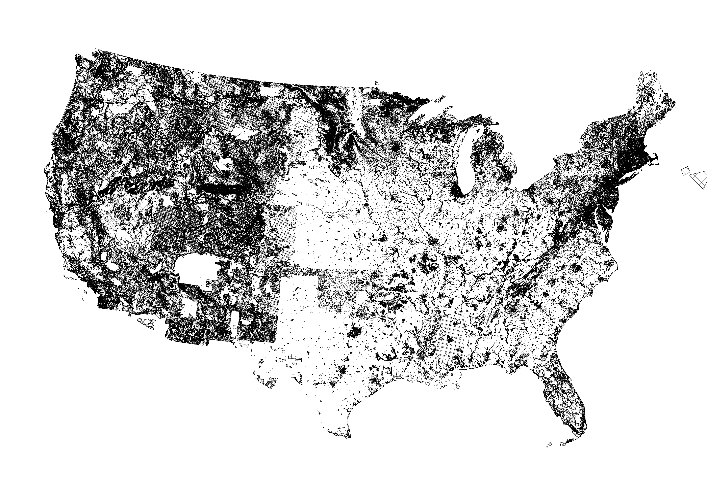

### landuse
# a national land use regulatory index

This repository reproduces a workflow to predict land use with a combination of satellite imagery, administrative data, street topology. The imagery used in the model comes from Google Earth Engine, and [this](https://code.earthengine.google.com/?scriptPath=users%2Fasrenninger%2Fgeosoftware%3Aworkflow_nj) script produces the files.  

- `help.R` constains a function to create spatially lagged variables
- `extract.R` allows us to convert raster imagery into tabular data
- `osmnx.ipynb` constructs variables from the street network
- `left.R` blends it all together to produce the left side of the regression
- `lag.R` runs a lasso for feature selection and random forest for prediction

